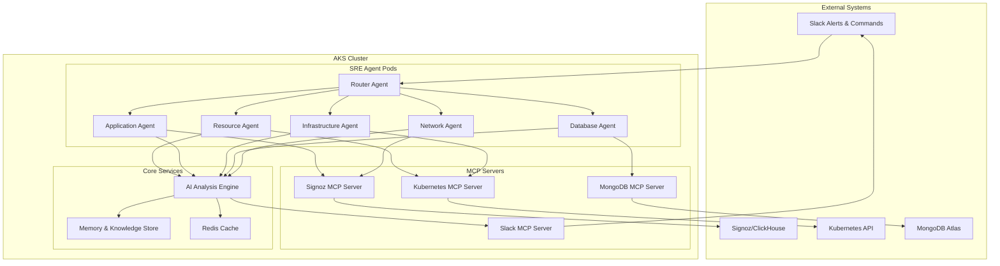

# SRE Agent - Architecture Diagrams & Implementation Approach

## Document Information
- **Version**: 1.0
- **Date**: January 2025
- **Author**: SRE Team
- **Status**: Draft

## 1. Executive Summary

This document provides comprehensive architecture diagrams, data flows, and implementation approach for the SRE Agent system. The architecture is designed to be scalable, maintainable, and highly performant while integrating seamlessly with existing infrastructure.

## 2. High-Level System Architecture

### 2.1 Overall System Overview



### 2.2 Component Interaction Flow


## 3. Detailed Component Architecture

### 3.1 Router Agent Architecture


### 3.2 Specialized Agent Architecture


### 3.3 AI Analysis Engine Architecture


## 4. Data Flow Architecture

### 4.1 Alert Processing Flow


### 4.2 On-Demand Analysis Flow


## 5. MCP Integration Architecture

### 5.1 MCP Server Ecosystem


### 5.2 MCP Server Implementation

```python
# MCP Server Architecture
class BaseMCPServer:
    """Base class for all MCP servers"""
    
    def __init__(self, name: str, description: str):
        self.name = name
        self.description = description
        self.tools = {}
    
    def register_tool(self, tool_name: str, tool_func: callable):
        """Register a tool with the MCP server"""
        self.tools[tool_name] = tool_func
    
    def execute_tool(self, tool_name: str, **kwargs):
        """Execute a tool by name"""
        if tool_name in self.tools:
            return self.tools[tool_name](**kwargs)
        else:
            raise ValueError(f"Tool {tool_name} not found")

class SignozMCPServer(BaseMCPServer):
    """MCP server for Signoz integration"""
    
    def __init__(self):
        super().__init__("signoz", "Signoz observability data server")
        self.client = SignozClient()
        self._register_tools()
    
    def _register_tools(self):
        self.register_tool("query_logs", self.query_logs)
        self.register_tool("query_metrics", self.query_metrics)
        self.register_tool("query_traces", self.query_traces)
        self.register_tool("get_service_health", self.get_service_health)
    
    def query_logs(self, service: str, time_range: str, filters: dict = None):
        """Query logs from Signoz"""
        return self.client.query_logs(service, time_range, filters)
    
    def query_metrics(self, metric_name: str, time_range: str, filters: dict = None):
        """Query metrics from Signoz"""
        return self.client.query_metrics(metric_name, time_range, filters)
    
    def query_traces(self, trace_id: str = None, service: str = None, time_range: str = None):
        """Query traces from Signoz"""
        return self.client.query_traces(trace_id, service, time_range)
    
    def get_service_health(self, service: str):
        """Get service health status"""
        return self.client.get_service_health(service)
```

## 6. Kubernetes Deployment Architecture

### 6.1 Pod Architecture


### 6.2 Service Mesh Architecture


## 7. Security Architecture

### 7.1 Security Layers


### 7.2 Authentication Flow


## 8. Monitoring and Observability Architecture

### 8.1 Monitoring Stack


### 8.2 Observability Data Flow


## 9. Implementation Approach

### 9.1 Development Phases


### 9.2 Deployment Strategy


## 10. Scalability Architecture

### 10.1 Horizontal Scaling

```mermaid
graph TB
    subgraph "Load Balancer"
        LB[Load Balancer]
    end
    
    subgraph "Agent Instances"
        A1[Agent Instance 1]
        A2[Agent Instance 2]
        A3[Agent Instance 3]
        AN[Agent Instance N]
    end
    
    subgraph "Shared Services"
        REDIS[Redis Cache]
        DB[(Database)]
        MQ[Message Queue]
    end
    
    LB --> A1
    LB --> A2
    LB --> A3
    LB --> AN
    
    A1 --> REDIS
    A2 --> REDIS
    A3 --> REDIS
    AN --> REDIS
    
    A1 --> DB
    A2 --> DB
    A3 --> DB
    AN --> DB
    
    A1 --> MQ
    A2 --> MQ
    A3 --> MQ
    AN --> MQ
```



### 10.2 Auto-scaling Configuration

```yaml
# Horizontal Pod Autoscaler
apiVersion: autoscaling/v2
kind: HorizontalPodAutoscaler
metadata:
  name: sre-agent-hpa
spec:
  scaleTargetRef:
    apiVersion: apps/v1
    kind: Deployment
    name: sre-agent
  minReplicas: 2
  maxReplicas: 10
  metrics:
  - type: Resource
    resource:
      name: cpu
      target:
        type: Utilization
        averageUtilization: 70
  - type: Resource
    resource:
      name: memory
      target:
        type: Utilization
        averageUtilization: 80
```

## 11. Disaster Recovery Architecture

### 11.1 Multi-Region Deployment


## 12. Conclusion

This architecture provides a robust, scalable, and maintainable foundation for the SRE Agent system. The modular design allows for easy extension and modification while ensuring high performance and reliability. The comprehensive monitoring and security layers ensure the system can operate safely in a production environment while providing valuable insights and automation capabilities.

