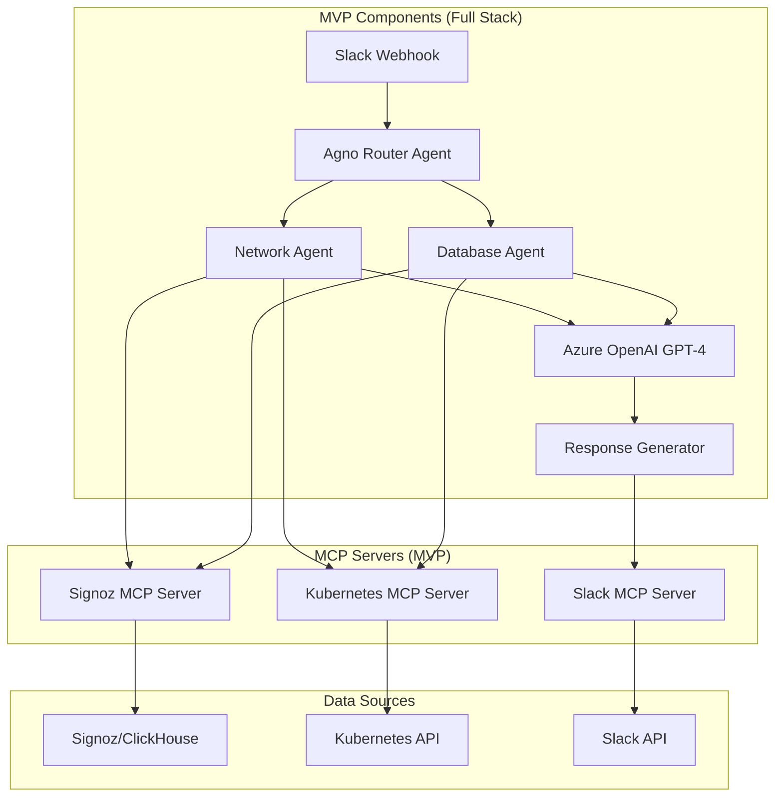
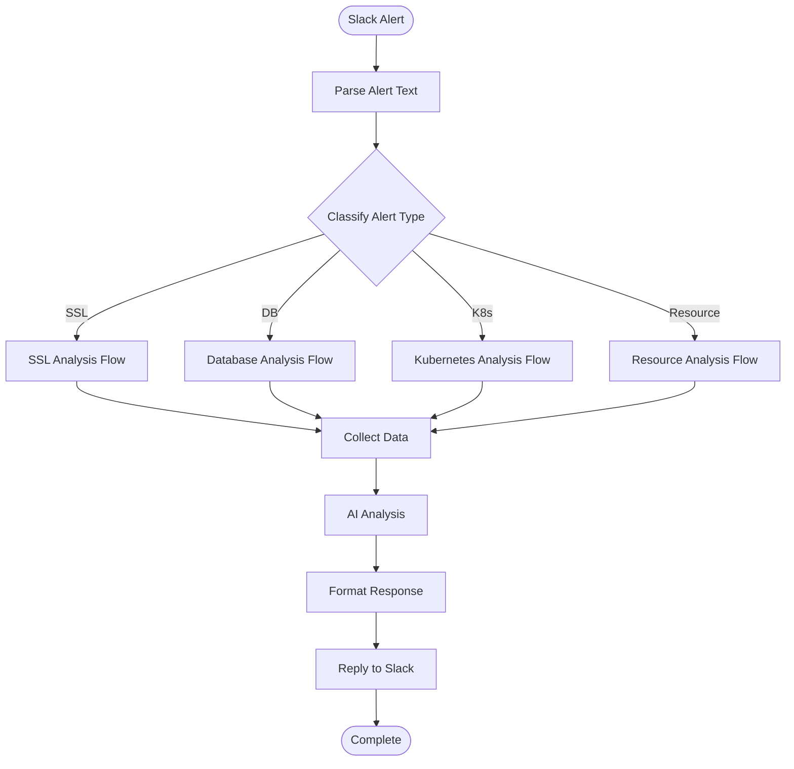

# SRE Agent - MVP (Minimum Viable Product) Plan

## Document Information
- **Version**: 1.0
- **Date**: January 2025
- **Author**: SRE Team
- **Status**: Draft

## 1. Executive Summary

This document outlines the MVP (Minimum Viable Product) for the SRE Agent project. The MVP focuses on delivering core value with minimal complexity, establishing the foundation for the full system while providing immediate benefits to the SRE team.

## 2. MVP Objectives

### 2.1 Primary Goals
- **Prove Value**: Demonstrate automated RCA capabilities with real alerts
- **Validate Architecture**: Test core components and integration patterns
- **User Feedback**: Gather user feedback for full system design
- **Foundation**: Establish technical foundation for scaling

### 2.2 Success Criteria
- Process 80% of common alert types (SSL, Database, K8s, Resource)
- Generate basic RCA reports within 5 minutes
- Achieve 70% user satisfaction
- Demonstrate 50% reduction in manual investigation time

## 3. MVP Scope

### 3.1 What's Included

#### 3.1.1 Core Features (Full Stack, Limited Scope)
- **2 Specialized Agents**: Network Agent + Database Agent (proves the pattern)
- **Full RCA**: Complete root cause analysis with timeline and remediation
- **Slack Integration**: Webhook processing and thread replies via Slack MCP
- **3 MCP Servers**: Signoz MCP + Kubernetes MCP + Slack MCP (proves the pattern)
- **Rich Response**: Structured Slack responses with formatting

#### 3.1.2 Alert Types (MVP Focus - 2 Agents)
1. **Network Agent** (50% of alerts)
   - SSL certificate expiration
   - Connection failures
   - DNS resolution issues
   - Network connectivity problems

2. **Database Agent** (50% of alerts)
   - MongoDB connection pool exhaustion
   - Query timeouts
   - Database connectivity issues
   - Performance degradation

### 3.2 What's Excluded (Future Phases)
- **Additional Agents**: Infrastructure Agent, Application Agent, Resource Agent
- **Additional MCP Servers**: MongoDB MCP
- **On-Demand Analysis**: Only automatic alert processing
- **Historical Analysis**: No past incident analysis
- **Advanced Routing**: ML-based classification (use simple rules in MVP)
- **Complex Workflows**: Multi-agent collaboration

## 4. MVP Architecture

### 4.1 MVP Architecture (Full Stack, Limited Scope)



### 4.2 Technology Stack (Full Stack, MVP Features)

#### 4.2.1 Core Technologies (Same as Full System)
- **Language**: Python 3.11
- **Framework**: Agno AgentOS (full framework from day 1)
- **AI**: Azure OpenAI GPT-4 (same as full system)
- **Agent Pattern**: Specialized agents (but only 2 agents in MVP)
- **Data**: MCP servers (but only 2 MCP servers in MVP)
- **Configuration**: Unpage YAML patterns (same as full system)

#### 4.2.2 Dependencies (Full Stack)
```python
# Full Stack Requirements (Same as Full System)
agno-agentos>=1.0.0
openai>=1.0.0
langchain>=0.1.0
pydantic>=2.0.0
fastapi>=0.100.0
uvicorn>=0.23.0
mcp>=1.0.0
signoz-client>=1.0.0
kubernetes>=28.0.0
slack-sdk>=3.0.0
redis>=4.0.0
```

## 5. MVP Implementation Plan

### 5.1 Phase 1: Foundation (Week 1-2)

#### Week 1: Agno AgentOS + MCP Setup
| Task | Duration | Deliverable |
|------|----------|-------------|
| Agno AgentOS setup | 2 days | Agent framework running |
| Signoz MCP Server | 1.5 days | MCP server for Signoz |
| Kubernetes MCP Server | 1 day | MCP server for K8s |
| Slack MCP Server | 0.5 days | MCP server for Slack |

#### Week 2: Router + Agent Implementation
| Task | Duration | Deliverable |
|------|----------|-------------|
| Router Agent | 2 days | Alert classification and routing |
| Network Agent | 2 days | SSL/Network issue analysis |
| Database Agent | 1 day | Database issue analysis |

### 5.2 Phase 2: AI Integration (Week 3-4)

#### Week 3: AI Engine + Slack Integration
| Task | Duration | Deliverable |
|------|----------|-------------|
| Azure OpenAI integration | 1 day | GPT-4 API connection |
| Agent AI prompts | 2 days | Specialized prompts per agent |
| Slack webhook + MCP | 2 days | Webhook processing and thread replies via Slack MCP |

#### Week 4: Testing & Polish
| Task | Duration | Deliverable |
|------|----------|-------------|
| End-to-end testing | 2 days | Full workflow testing |
| Error handling | 1 day | Robust error handling |
| Performance tuning | 1 day | < 5 min response time |
| Documentation | 1 day | User guide and deployment docs |

## 6. MVP Data Flow

### 6.1 Alert Processing Flow



### 6.2 MCP Integration Strategy

#### 6.2.1 Signoz MCP Server
```python
# Signoz MCP Server (Full Implementation)
class SignozMCPServer(MCPServer):
    def __init__(self):
        super().__init__("signoz-mcp-server")
        self.client = SignozClient()
        self._register_tools()
    
    def _register_tools(self):
        self.register_tool(Tool(
            name="query_logs",
            description="Query logs from Signoz",
            handler=self._query_logs
        ))
        self.register_tool(Tool(
            name="query_metrics", 
            description="Query metrics from Signoz",
            handler=self._query_metrics
        ))
        self.register_tool(Tool(
            name="query_traces",
            description="Query traces from Signoz", 
            handler=self._query_traces
        ))
```

#### 6.2.2 Kubernetes MCP Server
```python
# Kubernetes MCP Server (Full Implementation)
class KubernetesMCPServer(MCPServer):
    def __init__(self):
        super().__init__("kubernetes-mcp-server")
        self.client = KubernetesClient()
        self._register_tools()
    
    def _register_tools(self):
        self.register_tool(Tool(
            name="get_pod_status",
            description="Get pod status and events",
            handler=self._get_pod_status
        ))
        self.register_tool(Tool(
            name="get_service_health",
            description="Get service health status",
            handler=self._get_service_health
        ))
```

#### 6.2.3 Slack MCP Server
```python
# Slack MCP Server (Full Implementation)
class SlackMCPServer(MCPServer):
    def __init__(self):
        super().__init__("slack-mcp-server")
        self.client = SlackClient()
        self._register_tools()
    
    def _register_tools(self):
        self.register_tool(Tool(
            name="post_thread_reply",
            description="Post reply to Slack thread",
            handler=self._post_thread_reply
        ))
        self.register_tool(Tool(
            name="get_channel_info",
            description="Get channel information",
            handler=self._get_channel_info
        ))
        self.register_tool(Tool(
            name="get_thread_info",
            description="Get thread information",
            handler=self._get_thread_info
        ))
```

## 7. MVP AI Prompt Strategy

### 7.1 Agent-Specific Prompt Templates

#### 7.1.1 Network Agent Prompt
```python
NETWORK_AGENT_PROMPT = """
You are a Network SRE expert analyzing SSL/Network alerts. Provide detailed RCA.

Alert: {alert_message}
Service: {service_name}
Time: {timestamp}

Observability Data:
{signoz_data}
{kubernetes_data}

Analyze:
1. SSL certificate status and expiration
2. Network connectivity patterns
3. DNS resolution issues
4. Connection pool status

Provide:
- Root Cause (specific technical issue)
- Timeline (chronological events)
- Immediate Actions (exact commands/steps)
- Prevention (configuration changes)

Format as structured Slack message with emojis and code blocks.
"""
```

#### 7.1.2 Database Agent Prompt
```python
DATABASE_AGENT_PROMPT = """
You are a Database SRE expert analyzing MongoDB alerts. Provide detailed RCA.

Alert: {alert_message}
Service: {service_name}
Time: {timestamp}

Observability Data:
{signoz_data}
{kubernetes_data}

Analyze:
1. MongoDB connection pool status
2. Query performance metrics
3. Database connectivity issues
4. Resource utilization

Provide:
- Root Cause (specific database issue)
- Timeline (chronological events)
- Immediate Actions (exact commands/steps)
- Prevention (configuration changes)

Format as structured Slack message with emojis and code blocks.
"""
```

### 7.2 Router Classification (Simple Rules)

```python
def classify_alert(alert_text):
    """Simple keyword-based classification for MVP."""
    alert_lower = alert_text.lower()
    
    # Network/SSL keywords
    if any(keyword in alert_lower for keyword in ['ssl', 'certificate', 'tls', 'connection', 'dns', 'network']):
        return 'network'
    
    # Database keywords  
    elif any(keyword in alert_lower for keyword in ['database', 'mongodb', 'query', 'connection pool', 'db']):
        return 'database'
    
    # Default to network for unknown
    else:
        return 'network'
```

## 8. MVP Response Format

### 8.1 Rich Slack Response Template

```
🔍 **Root Cause Analysis** | `{agent_type}` Agent

**Service:** `{service_name}`
**Alert:** {alert_message}
**Time:** {timestamp}

**🎯 Root Cause:**
{root_cause}

**📅 Timeline:**
{timeline}

**⚡ Immediate Actions:**
{immediate_actions}

**🛡️ Prevention:**
{prevention}

**📊 Metrics:**
{key_metrics}

---
*Generated by SRE Agent MVP | Response time: {response_time}s*
```

## 9. MVP Testing Strategy

### 9.1 Test Scenarios

#### 9.1.1 SSL Certificate Expiration
```python
def test_ssl_certificate_expiration():
    """Test SSL certificate expiration alert."""
    alert = {
        "text": "SSL certificate for api.example.com expires in 24 hours",
        "channel": "alerts"
    }
    
    response = process_alert(alert)
    
    assert "certificate" in response.lower()
    assert "expir" in response.lower()
    assert "renew" in response.lower()
```

#### 9.1.2 Database Connection Pool
```python
def test_database_connection_pool():
    """Test database connection pool exhaustion."""
    alert = {
        "text": "Database connection pool exhausted for user-service",
        "channel": "alerts"
    }
    
    response = process_alert(alert)
    
    assert "connection" in response.lower()
    assert "pool" in response.lower()
    assert "scale" in response.lower()
```

### 9.2 Performance Testing

```python
def test_response_time():
    """Test response time under 5 minutes."""
    start_time = time.time()
    
    alert = create_test_alert()
    response = process_alert(alert)
    
    duration = time.time() - start_time
    assert duration < 300  # 5 minutes
```

## 10. MVP Deployment

### 10.1 Simple Deployment

#### 10.1.1 Docker Setup
```dockerfile
FROM python:3.11-slim

WORKDIR /app
COPY requirements.txt .
RUN pip install -r requirements.txt

COPY . .
CMD ["uvicorn", "main:app", "--host", "0.0.0.0", "--port", "8000"]
```

#### 10.1.2 Kubernetes Deployment
```yaml
apiVersion: apps/v1
kind: Deployment
metadata:
  name: sre-agent-mvp
spec:
  replicas: 2
  selector:
    matchLabels:
      app: sre-agent-mvp
  template:
    metadata:
      labels:
        app: sre-agent-mvp
    spec:
      containers:
      - name: sre-agent
        image: sre-agent-mvp:latest
        ports:
        - containerPort: 8000
        env:
        - name: OPENAI_API_KEY
          valueFrom:
            secretKeyRef:
              name: sre-agent-secrets
              key: openai-api-key
        - name: SLACK_BOT_TOKEN
          valueFrom:
            secretKeyRef:
              name: sre-agent-secrets
              key: slack-bot-token
```

## 11. MVP Success Metrics

### 11.1 Technical Metrics
- **Response Time**: < 5 minutes for 90% of alerts
- **Accuracy**: 70% of RCA reports are helpful
- **Uptime**: 99% availability
- **Error Rate**: < 5% processing errors

### 11.2 User Metrics
- **Adoption**: 80% of SRE team uses the system
- **Satisfaction**: 4.0/5.0 average rating
- **Time Savings**: 50% reduction in investigation time
- **Feedback**: Positive feedback on RCA quality

## 12. MVP to Full System Migration

### 12.1 Migration Path

#### Phase 1: MVP (4 weeks)
- Single agent, basic RCA
- Slack integration
- Signoz + K8s data only

#### Phase 2: Enhanced MVP (4 weeks)
- Add MongoDB integration
- Improve AI prompts
- Add basic MCP servers

#### Phase 3: Specialized Agents (4 weeks)
- Implement Agno AgentOS
- Create specialized agents
- Add Unpage configuration

#### Phase 4: Full System (4 weeks)
- Complete MCP integration
- Advanced AI features
- Rich formatting and on-demand analysis

### 12.2 Code Evolution Strategy (No Rewrites)

```python
# MVP: 2 Agents + 3 MCP Servers (Full Stack)
class SREAgentMVP:
    def __init__(self):
        self.router = RouterAgent()
        self.agents = {
            'network': NetworkAgent(),      # MVP Agent
            'database': DatabaseAgent()     # MVP Agent
        }
        self.mcp_servers = {
            'signoz': SignozMCPServer(),    # MVP MCP
            'kubernetes': KubernetesMCPServer(),  # MVP MCP
            'slack': SlackMCPServer()       # MVP MCP
        }
    
    def process_alert(self, alert_data):
        agent_type = self.router.route(alert_data)
        agent = self.agents[agent_type]
        return agent.analyze(alert_data)

# Full System: Add More Agents (No Rewrite)
class SREAgentFull:
    def __init__(self):
        self.router = RouterAgent()
        self.agents = {
            'network': NetworkAgent(),        # Same as MVP
            'database': DatabaseAgent(),      # Same as MVP
            'infrastructure': InfrastructureAgent(),  # Add new
            'application': ApplicationAgent(),        # Add new
            'resource': ResourceAgent()               # Add new
        }
        self.mcp_servers = {
            'signoz': SignozMCPServer(),      # Same as MVP
            'kubernetes': KubernetesMCPServer(),  # Same as MVP
            'slack': SlackMCPServer(),        # Same as MVP
            'mongodb': MongoDBMCPServer()     # Add new
        }
    
    def process_alert(self, alert_data):
        agent_type = self.router.route(alert_data)
        agent = self.agents[agent_type]
        return agent.analyze(alert_data)
```

## 13. MVP Risk Mitigation

### 13.1 Technical Risks
- **AI Accuracy**: Start with simple prompts, iterate based on feedback
- **Performance**: Implement caching and async processing
- **Integration**: Use proven libraries and simple patterns

### 13.2 Business Risks
- **User Adoption**: Focus on high-value alerts first
- **Value Demonstration**: Measure and communicate time savings
- **Feedback Loop**: Regular user feedback sessions

## 14. MVP Budget Estimate

### 14.1 Development Costs
- **Development Time**: 4 weeks (2 developers)
- **Infrastructure**: Minimal (existing AKS cluster)
- **AI Costs**: ~$200/month (GPT-3.5-turbo usage)
- **Total MVP Cost**: ~$15,000

### 14.2 ROI Calculation
- **Time Savings**: 2 hours/day × 5 SREs × $100/hour = $1,000/day
- **Monthly Savings**: $20,000
- **Payback Period**: 3 weeks

## 15. Conclusion

The MVP approach delivers immediate value while establishing the foundation for the full SRE Agent system. By focusing on the most common alert types and using proven, simple technologies, we can validate the concept quickly and cost-effectively.

The 4-week timeline allows for rapid iteration and user feedback, ensuring the full system addresses real user needs. The migration path ensures that MVP investments are preserved and enhanced in the full system.

**Key MVP Benefits:**
- ✅ Quick time to value (4 weeks)
- ✅ Low risk and cost
- ✅ Validates core concepts
- ✅ Establishes foundation
- ✅ Enables user feedback
- ✅ Clear migration path

This MVP approach maximizes learning while minimizing risk, setting up the project for long-term success.
